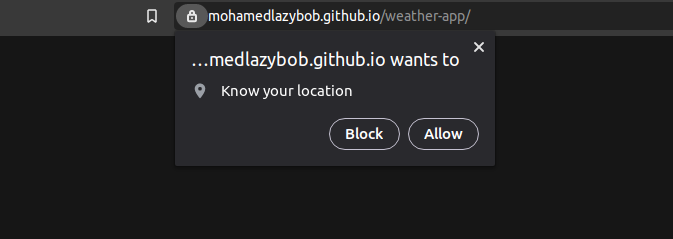
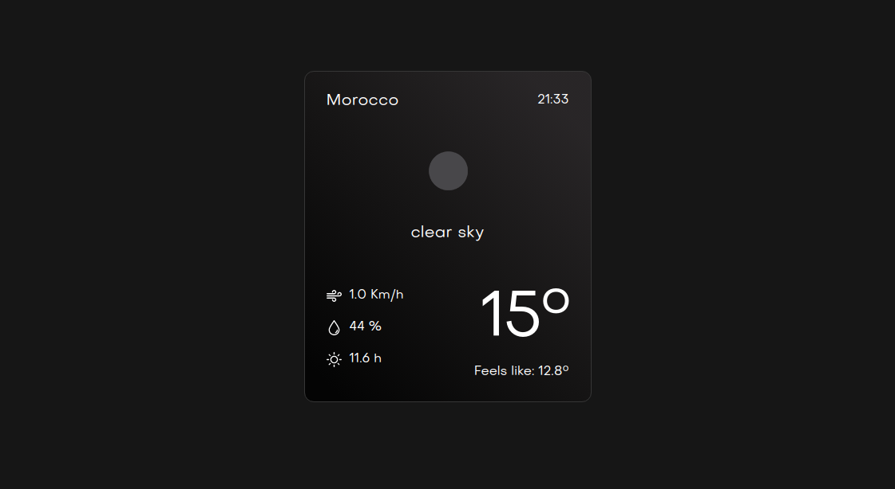

# Weather app

This weather app uses **open weather api** and your **gps location** to tell you today's weather with some other usefull information. 

**Ps:** Don't forget to accept your gps access requist. and if you're using your phone enable gps location first!

[Click me!](https://mohamedlazybob.github.io/weather-app/)

    
    

